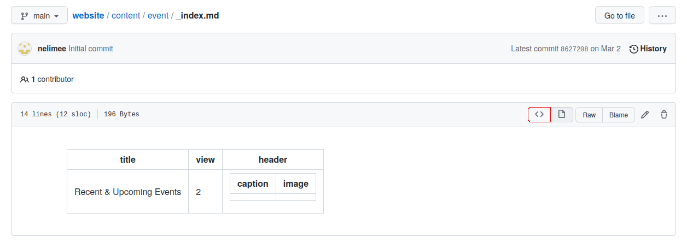

# QuantUM group website

This is the `git` repository hosting the code required to generate the QuantUM website. A few usefull links and explanations are provided here.

## Directory explanations

The only directory that you might want to look at is [`content`](./content/). This is where all the content of the website is located. Configuration and styles are located elsewhere, if you want to change this please contact me.

In the [`content`](./content/) directory, the following folders are useful:

- [`content/authors`](./content/authors/) that contains one directory per "author". An "author" is anyone that is within the team. Note that non-LIRMM people can still be associated to content, for example being on a paper or writing a blog post, even if they do not have a folder in `content/authors`. In which case, their full name should be added.
- [`content/contact`](./content/contact/) used to provide contact information that will be displayed in the "Contact" tab.
- [`content/event`](./content/event/) is a folder containing one directory per "event".
- [`content/people`](./content/people/) used to configure the "Meet the team" page that list all the "authors" that are in [`content/authors`](./content/authors/) and that match the `user_groups`.
- [`content/posts`](./content/posts/) is a folder containing one directory per "post".
- [`content/publication`](./content/publication/) is a folder containing one directory per scientific publication.

## How to correctly read files in GitHub

Most of the files used by this website are composed of 2 distinct blocks:

1. A preamble (or "front matter"), written using the YAML syntax and enclosed in `---` delimiters.
2. The main content, written using the Markdown syntax.

GitHub automatically reads files ending with the `.md` extension with the Markdown syntax, leading to "tables" appearing in the GitHub rendering. In order to see the front matter of a given file in GitHub, you have to click on the red button shown in the image below.

## Usefull links

- [How to create a blog post](./docs/how_to_blog_post.md)
- [Syntax for blog posts](./docs/blog_post_syntax.md)

## Demo Credits

Please replace the demo images with your own.

- [Female scientist](https://unsplash.com/photos/uVnRa6mOLOM)
- [2 Coders](https://unsplash.com/photos/kwzWjTnDPLk)
- [Cafe](https://unsplash.com/photos/RnDGGnMEOao)
- Blog posts
  - https://unsplash.com/photos/AndE50aaHn4
  - https://unsplash.com/photos/OYzbqk2y26c
- Avatars
  - https://unsplash.com/photos/5yENNRbbat4
  - https://unsplash.com/photos/WNoLnJo7tS8
